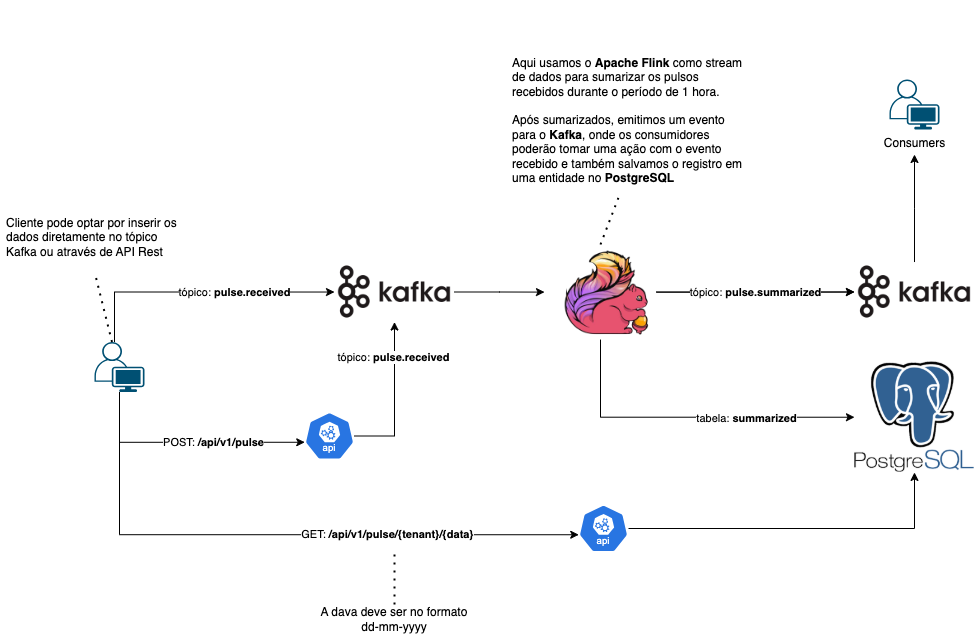

[Collection Postman](Magalu-API.postman_collection.json)

# Guia de Instalação e Execução

Este guia descreve como subir as dependências usando `docker-compose`, rodar a API `magalu-api` no VSCode e configurar o Flink para processar os eventos.

## Tecnologias Utilizadas

- **Java 17**
- **Spring Boot**
- **Apache Kafka**
- **Apache Flink**
- **PostgreSQL**
- **Keycloak**
- **Docker / Docker Compose**

## 1. Subindo as dependências com Docker Compose

No diretório raiz do repositório, execute o seguinte comando para iniciar os containers do Kafka, PostgreSQL, Flink e Keycloak:

```sh
docker-compose up -d
```

Este comando irá subir os containers necessários para execução do projeto.

---

## 2. Rodando a API `magalu-api` no VSCode

### Abrindo o Projeto no VSCode

1. Abra o diretório `magalu-api` no VSCode.
2. Certifique-se de que você tem a extensão do Java instalada.

### Executando a API

1. No VSCode, abra a classe principal `MagaluApiApplication.java`.
2. Pressione `F5` para iniciar a execução.

A API será iniciada na porta `8083`.

---

## 3. Configurando o Flink para rodar o `magalu-in`

A interface do Flink pode ser acessada através de:

```
http://localhost:8081
```

Para adicionar o JAR do `magalu-in` e iniciar o processamento:

1. Acesse a UI do Flink.
2. No menu superior, clique em **Submit New Job**.
3. Faça upload do arquivo `magalu-in.jar` localizado no diretório `magalu-in/target/`.
4. Configure o job com as propriedades adequadas.
5. Inicie o job para começar o processamento dos eventos.

---

## 4. Autenticação com Keycloak

A API utiliza Keycloak para autenticação. Para obter um token de acesso, siga os passos abaixo:

1. Acesse a interface do Keycloak em:
   ```
   http://localhost:8080/auth
   ```
2. Faça login com as credenciais padrão (definidas no `docker-compose.yml`).
3. Obtenha um token de acesso executando a seguinte requisição:
   
   ```sh
   curl --location 'localhost:8080/realms/mglc/protocol/openid-connect/token' \
        --header 'Content-Type: application/x-www-form-urlencoded' \
        --data-urlencode 'grant_type=client_credentials' \
        --data-urlencode 'client_id=mglc-client-id' \
        --data-urlencode 'client_secret=mglc-client-secret'
   ```

4. O token será retornado no campo `access_token`, e deverá ser incluído no cabeçalho das requisições:
   
   ```http
   Authorization: Bearer SEU_TOKEN_AQUI
   ```

---

## 5. Consumindo a API

A API possui os seguintes endpoints:

### Criar um novo pulso (Enviar para Kafka)

**Requisição:**

```http
POST /api/v1/pulse
Content-Type: application/json
Authorization: Bearer SEU_TOKEN_AQUI

{
  "tenant" : "tenant",
  "productSku" : "sku-4562",
  "usedAmount" : 30,
  "useUnity" : "KB"
}
```

**Resposta:**
```json
{
  "tenant" : "tenant",
  "productSku" : "sku-4562",
  "usedAmount" : 30,
  "useUnity" : "KB"
}
```

### Consultar pulsos sumarizados

**Requisição:**
```http
GET /api/v1/pulse/empresa-x/2025-02-01
Authorization: Bearer SEU_TOKEN_AQUI
```

**Resposta:**
```json
[
    {
        "productSku": "sku",
        "summarizedAmount": 210.00000,
        "useUnity": "4562",
        "summarizedDate": "2025-02-01"
    },
    {
        "productSku": "sku",
        "summarizedAmount": 210.00000,
        "useUnity": "4562",
        "summarizedDate": "2025-02-01"
    },
    {
        "productSku": "sku",
        "summarizedAmount": 330.00000,
        "useUnity": "4562",
        "summarizedDate": "2025-02-01"
    }
]
```
---

## 6. Enviando Mensagem Diretamente para o Kafka

Se quiser enviar um evento diretamente para o Kafka (sem usar a API REST), utilize o seguinte comando:

```sh
echo '{ "tenant" : "tenant", "productSku" : "sku-4562", "usedAmount" : 30, "useUnity" : "KB" }' | kafka-console-producer --broker-list localhost:9092 --topic pulse.received
```

Isso insere um evento diretamente no tópico Kafka `pulse.received`.

---